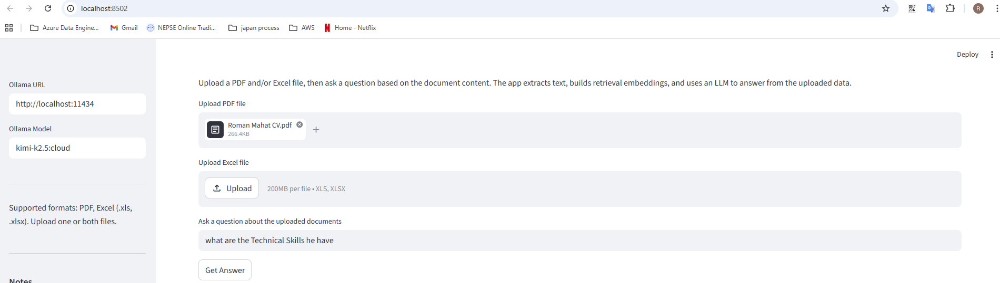

# RAG-App

A simple Retrieval-Augmented Generation (RAG) app for PDF and Excel documents.

## Features

- Upload PDF and/or Excel files
- Extract text from PDF pages and Excel sheets
- Build semantic embeddings for document chunks
- Retrieve relevant context for a question
- Use OpenAI GPT to answer based on uploaded data

## Setup

1. Create a Python environment:

```bash
python -m venv .venv
.\.venv\Scripts\activate
```

2. Install dependencies:

```bash
pip install -r requirements.txt
```

3. Copy the example env file and set your Ollama settings:

```bash
copy .env.example .env
```

4. Add your Ollama settings to `.env`:

```text
OLLAMA_URL=http://127.0.0.1:11434
OLLAMA_MODEL=kimi-k2.5:cloud
```

## Run

```bash
streamlit run app.py
```

Then open the Streamlit app in your browser.



## Usage

- Upload a PDF or Excel file using the app interface.
- Configure Ollama URL and model in the sidebar if needed.
- Enter a question about the uploaded data.
- Click **Get Answer** to see the retrieved context and the generated response.

## Notes

- Excel uploads support `.xls` and `.xlsx`.
- The app uses semantic retrieval over document chunks, so more specific questions give better results.
